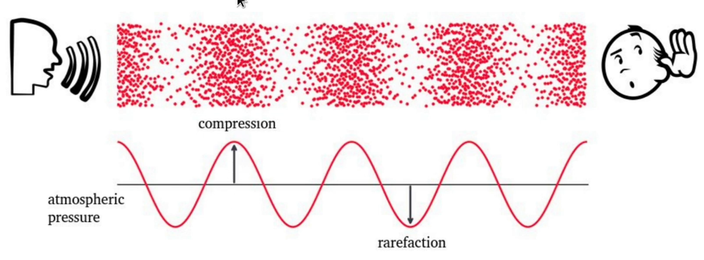
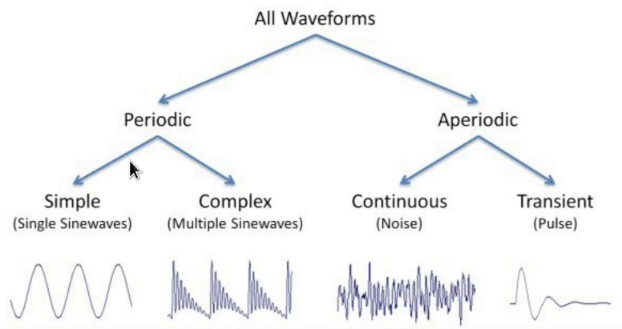
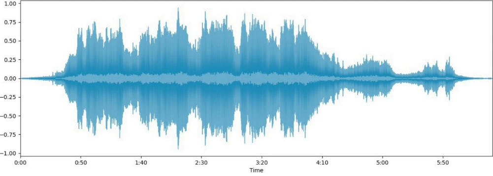
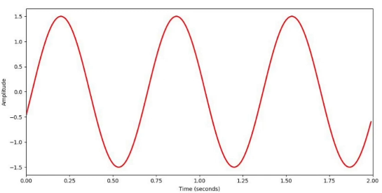

# Som

- Produzido pela vibração de um objeto

- Vibrações fazem com que as moléculas de ar oscilem

- Mudança na pressão do ar cria uma onda

A vibração de um objeto é como um "empurrão" inicial que coloca as moléculas de ar em movimento. Esse movimento, por sua vez, cria uma onda que se propaga pelo ar, transportando a energia da vibração original até nossos ouvidos.

---
# Onda mecânica
- Uma onda é uma perturbação que se propaga através de um meio, transportando energia sem transportar matéria.

- Energia viaja de um ponto a outro

- As partículas do meio se deslocam de suas posições de equilíbrio

**Ondas mecânicas:** São perturbações que se propagam através de um meio material (como água, ar, sólidos), transportando energia de um ponto a outro **sem transportar matéria**.

**Propagação:** A energia transportada pela onda se move de forma ondulatória, ou seja, oscilações se propagam através do meio.

---

# Onda sonora

- **A parte de cima:** Representa como as ondas sonoras viajam pelo ar. As bolinhas vermelhas simbolizam as moléculas de ar. Quando um som é produzido, ele faz com que essas moléculas vibrem, criando áreas de alta pressão (compressão) e baixa pressão (rarefação). É como se o ar estivesse sendo comprimido e descomprimido em sequência.

- **A parte de baixo:** Mostra a representação gráfica dessas ondas de pressão. A linha vermelha representa a variação da pressão do ar ao longo do tempo. Os picos representam as compressões (onde o ar está mais denso) e os vales representam as rarefações (onde o ar está menos denso).
	- **Compressão:** Imagine as moléculas de ar como pequenas bolinhas. Quando uma onda sonora se propaga, essas bolinhas são comprimidas em determinadas regiões, aumentando a densidade do ar nesses pontos. É como se o ar fosse "apertado" momentaneamente.
	
	- **Rarefação:** Em seguida, essas mesmas moléculas são "espalhadas", criando regiões com menor densidade de ar. É como se o ar fosse "esticado".

**A pressão atmosférica entra nessa história da seguinte forma:**
- **Pressão atmosférica normal:** É a força exercida pelo ar sobre nós o tempo todo. É como se uma camada de ar estivesse pressionando a Terra.

- **Ondas sonoras e pressão:** As ondas sonoras causam pequenas variações nessa pressão atmosférica. Quando há uma compressão, a pressão aumenta um pouquinho; quando há uma rarefação, a pressão diminui um pouquinho.

- **Nossos ouvidos:** Nossos ouvidos são sensíveis a essas pequenas variações de pressão. Quando as ondas sonoras atingem nossos tímpanos, eles vibram, e nosso cérebro interpreta essas vibrações como sons.

---
# Som periódico e aperiódico

## Som Periódico
Um som periódico é aquele que se repete ao longo do tempo de forma regular e previsível. Isso significa que o padrão de vibração das partículas do meio (geralmente o ar) que transmite o som se repete em intervalos de tempo iguais.
#### Características principais 
- **Período:** É o tempo que leva para o padrão da onda se repetir completamente.

- **Frequência:** É o número de vezes que o padrão se repete em um segundo. Quanto maior a frequência, mais agudo o som.

- **Amplitude:** Representa a intensidade do som, ou seja, o quanto ele é alto ou baixo.

### Som Periódico Simples
É a forma de onda mais básica, como a produzida por um diapasão. Ela possui apenas uma frequência e uma amplitude. ==É uma onda senoidal==, de fato, a forma de onda mais fundamental e pura que podemos encontrar, na matemática ela é muito conveniente para nós. **Imagine-a como uma ondulação perfeita e contínua, como as que se formam na superfície de um lago quando jogamos uma pequena pedra.**

#### Porque a onda senoidal é tão especial?
- **Simplicidade:** A onda senoidal é descrita por uma única função matemática (a função seno), o que a torna extremamente fácil de analisar e manipular.

- **Pureza:** Ela possui apenas uma frequência, ou seja, ela vibra com uma única velocidade constante. Isso significa que ela produz um único tom puro, sem harmônicos ou outras frequências misturadas.

- **Universalidade:** Ondas senoidais estão presentes em diversos fenômenos naturais, como o som, a luz e as ondas eletromagnéticas. Elas são a base para a construção de sinais mais complexos.

#### Por que é conveniente na matemática de algumas ondas de som?
- **Decomposição:** Qualquer som complexo pode ser decomposto em uma soma de ondas senoidais com diferentes frequências e amplitudes. Essa propriedade, conhecida como **análise de Fourier**, é fundamental para a compreensão e manipulação de sinais de áudio.

- **Modelagem:** As ondas senoidais são utilizadas como modelos para simular e analisar diversos sistemas físicos, desde circuitos eletrônicos até instrumentos musicais.

- **Processamento de sinais:** A transformada de Fourier, uma ferramenta matemática baseada nas ondas senoidais, é amplamente utilizada em diversas áreas, como engenharia, física e processamento de imagens.

### Som Periódico Complexo
Sons complexos são formados pela combinação de múltiplas ondas senoidais com diferentes frequências e amplitudes. Essa sobreposição de ondas cria padrões complexos que resultam em uma rica variedade de timbres. A voz humana, por exemplo, é um som complexo que varia conforme a pessoa, devido à combinação única de harmônicos presentes. Da mesma forma, os instrumentos musicais produzem sons complexos característicos, onde a frequência fundamental e seus harmônicos inteiros se combinam para definir o timbre.

## Som Aperiódico 
Um som aperiódico é aquele que não apresenta um padrão repetitivo ao longo do tempo. Diferentemente dos sons periódicos, onde a forma da onda se repete em intervalos regulares, os sons aperiódicos possuem uma estrutura irregular e aleatória. Essa característica os torna mais difíceis de analisar matematicamente.

### Som Aperiódico continuo
São aqueles que se prolongam no tempo, sem um início ou fim claramente definidos. Um exemplo clássico é o ruído branco, que contém todas as frequências audíveis com a mesma intensidade. A natureza aleatória da variação da pressão do ar em um som aperiódico contínuo confere a ele um caráter mais "ruidoso" e menos musical.". Além disso podemos podemos citar ruídos de trânsito, o som de uma cachoeira.

### Som Aperiódico transitório
Sons aperiódicos transitórios são eventos sonoros de curta duração, caracterizados por uma mudança abrupta na pressão do ar. Imagine-os como pulsos sonoros, como o som de um clique ou um estalo. Esses sons são o oposto dos sons musicais, que possuem um padrão repetitivo. A energia sonora é liberada de forma rápida e concentrada, e a pressão do ar retorna rapidamente ao seu estado normal após o evento. Devido à sua curta duração e natureza aleatória, os sons aperiódicos transitórios são mais difíceis de analisar e sintetizar do que os sons periódicos.

---
# Forma de onda 

Agora podemos representar um som complexo ousando a forma de onda, quase como que vimos anteriormente, porém agora com algo real. Ela pode ser extraída de qualquer Áudio e expressa dessa forma. É uma forma rápida de compreensão e da visualização de um áudio. 

## Características das formas de onda
- Frequência
- Intensidade
- Timbe

---
# Representação de uma onda senoidal

Podemos replicar essa mesma onda senoidal com uma função matemática
$y(t) = A sin(2πft +$φ)

onde:

$A=$ Amplitude
- Define o valor máximo que a onda atinge acima ou abaixo de sua posição de equilíbrio.

- Representa a "intensidade" da onda: quanto maior a amplitude, mais "alta" ou "forte" será a onda.
- 
$2πf=$ Frequência angular
- **f:** Frequência da onda, medida em Hertz (Hz). Indica o número de oscilações completas que a onda realiza em um segundo.

- **2π:** Um fator de conversão para transformar a frequência em frequência angular. A frequência angular mede a taxa de mudança do ângulo dentro da função seno.

$t =$ Tempo
- A variável independente que indica o instante de tempo em que estamos observando a onda.

$φ$ = Fase inicial
- Representa o deslocamento horizontal da onda em relação a uma onda senoidal padrão que passa pela origem (0,0).

- A fase inicial determina onde a onda se encontra no início do processo oscilatório.

### O Papel da Fase Inicial (φ)

A fase inicial (φ) é um parâmetro crucial que define o ponto de partida da onda. Imagine um carrossel: cada cavalo no carrossel está em uma posição diferente quando o carrossel começa a girar. Essa posição inicial é análoga à fase inicial de uma onda.

- **φ = 0:** A onda começa no ponto de equilíbrio (valor zero) e se move para cima.
- **φ = π/2:** A onda começa no valor máximo da amplitude.
- **φ = π:** A onda começa no ponto de equilíbrio, mas se move para baixo.
- **φ = 3π/2:** A onda começa no valor mínimo da amplitude.

**Em resumo:**

- A fase inicial determina o ponto de partida da oscilação.
- Alterando o valor de φ, você "desloca" a onda para a esquerda ou para a direita no eixo do tempo, sem alterar sua forma ou frequência.
